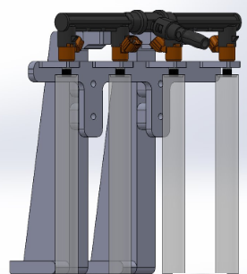

# injectorcharacterization
This is the project repo for a custom injector characterization stand for E85 and 93 Octane gasoline flowbench testing

To start the project, a breadboard, MOSFETs, resistors, and simple LEDs were utilized to symbolize the firing signals of the fuel injectors. This allowed me to time the injectors properly and ensure accuracy to real engine operation when testing with the actual injectors and fuel.

